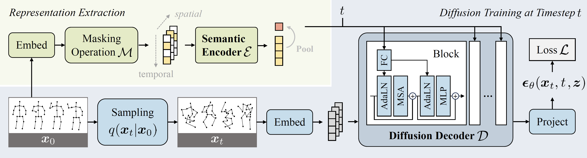

# [ECCV 2024] MacDiff: Unified Skeleton Modeling with Masked Conditional Diffusion

<!-- 🤗 -->
<font size=4><div align='center'>[[📝 Paper](https://arxiv.org/abs/2409.10473)] [[📄 Supplementary](https://lehongwu.github.io/ECCV24MacDiff/macdiff-supp.pdf)] [[🚀 Website](https://lehongwu.github.io/ECCV24MacDiff/index.html)]</div></font>


<div align="center">
<div>
  <font size=5>
    <p>🎉  <b>Accepted by ECCV 2024</b></p>
  </font>
</div>
</div>

<div align="center">
  
</div>


## Installation

```bash
conda create -n macdiff python=3.8

conda activate macdiff

pip install -r requirements.txt
```


## Data Preparation

The processing scripts and split statistics are taken from
[MAMP](https://github.com/maoyunyao/MAMP). Download the skeleton-only NTU RGB+D
60/120 archives and the skeleton, label, and split files for PKU-MMD Phase I/II,
then arrange them outside this repository as follows:

```text
../data/
├── nturgbd_raw/
│   └── nturgb+d_skeletons/        # NTU RGB+D 60, setups S001-S017
├── nturgbd_raw_120/
│   └── nturgb+d_skeletons120/     # NTU RGB+D 120 extension, S018-S032
├── pku_raw/
│   ├── v1/
│   │   ├── label/
│   │   ├── skeleton/
│   │   ├── cross_subject.txt
│   │   └── cross_view.txt
│   └── v2/
│       ├── label/
│       ├── skeleton/
│       ├── cross_subject_v2.txt
│       └── cross_view_v2.txt
└── MAMP/                           # generated automatically
```

Run all commands from the MacDiff repository root:

```bash
# NTU RGB+D 60
python data/ntu/get_raw_skes_data.py
python data/ntu/get_raw_denoised_data.py
python data/ntu/seq_transformation.py

# NTU RGB+D 120 (also reads the NTU 60 directory above)
python data/ntu120/get_raw_skes_data.py
python data/ntu120/get_raw_denoised_data.py
python data/ntu120/seq_transformation.py

# PKU-MMD Phase I and Phase II
python data/pku_v1/pku_gendata.py
python data/pku_v2/pku_gendata.py
```

The generated datasets are written to `../data/MAMP/ntu/`,
`../data/MAMP/ntu120/`, `../data/MAMP/pku_v1/`, and
`../data/MAMP/pku_v2/`. All pretraining, linear-probe, and fine-tuning YAML
files already read from these locations.

For OSE peer pretraining, create a JSON file containing exactly one immutable
training-set index for every semantic class, following
`config/exemplar_indices.example.json`, and set `ose_exemplar_indices` in the
OSE YAML. The example contains only three illustrative entries and is not a
complete NTU-60 mapping. The loader verifies the class of every exemplar and
removes those exemplars from the unlabeled sampler. The OSE configuration uses
the AimCLR skeleton setting: one shared 32768-entry queue, mutually exclusive
P1 neighbor pools with four neighbors per class, `alpha=0.75`,
`tau_s=0.1`, and `tau_t=0.04`. `lambda_ose` weights the complete
`L_proto = L_align + L_dispersion` objective; prototypes used by this loss are
rebuilt from online exemplar embeddings on every step, while the epoch-frozen
prototype snapshot is used only for peer routing. The training log also reports
ground-truth-label diagnostics for frozen neighbor edges and realized
cross-sample targets. These labels stay in the feeder/training engine and are
never passed to the model, routing logic, loss, or backward graph.

Generate a reproducible complete NTU60 XSub mapping with seed 0:

```bash
python generate_ose_exemplar_indices.py
```

For another archive or split, provide explicit paths and keep the generated
JSON with the experiment:

```bash
python generate_ose_exemplar_indices.py \
  --data_path ../data/MAMP/ntu120/NTU120_XSub.npz \
  --output_path config/ntu120_xsub_joint/exemplar_indices.json \
  --seed 0
```

Training is split at `ose_start_epoch: 100`. Epochs 0-99 optimize only the
native MacDiff diffusion and token-uniformity losses while the EMA encoder and
Queue are warmed without gradients. At epoch 100, OSE prototype loss and
cross-instance reconstruction are enabled; the peer probability then increases
linearly from 0.1 at epoch 100 to 0.9 at the final epoch.

`ose_start_epoch` can be overridden directly on the command line. Exemplar-only
gradient checkpointing is disabled by default and can be enabled with
`--ose_exemplar_checkpoint`; it preserves OSE gradients while recomputing the
eight exemplar encoder blocks during backward. To compare CUDA peaks on one
GPU, run from the repository root:

```bash
bash script_profile_ose_memory.sh \
  config/ntu60_xsub_joint/exemplar_indices.json
```

The script sets `ose_start_epoch=0`, runs both checkpoint modes sequentially,
and reports PyTorch's peak allocated/reserved memory. It defaults to two epochs
and 20 iterations per epoch so the second epoch also measures a non-empty
Queue. Override these without editing files, for example:

```bash
PROFILE_STEPS=50 PROFILE_BATCH_SIZE=16 CUDA_VISIBLE_DEVICES=0 \
  bash script_profile_ose_memory.sh \
  config/ntu60_xsub_joint/exemplar_indices.json
```

### Native MacDiff and OSE pretraining

`enable_ose` selects two independent pretraining paths. It defaults to `False`,
so the original `pretrain_madiff.yaml` files use the native four-item feeder,
native MacDiff forward, and no momentum encoder, Queue, exemplar exclusion, or
peer reconstruction. The OSE YAML sets `enable_ose: True` explicitly.

For two GPUs, run the native NTU60 XSub baseline with:

```bash
CUDA_VISIBLE_DEVICES=0,1 NPROC_PER_NODE=2 \
  OUTPUT_DIR=./output_dir/ntu60_xsub_macdiff \
  bash script_pretrain_madiff.sh
```

Run the OSE experiment with:

```bash
CUDA_VISIBLE_DEVICES=0,1 python -m torch.distributed.launch \
  --nproc_per_node=2 --master_port=10235 main_pretrain.py \
  --config ./config/ntu60_xsub_joint/pretrain_madiff_ose_peer.yaml \
  --ose_exemplar_indices config/ntu60_xsub_joint/exemplar_indices.json \
  --output_dir ./output_dir/ntu60_xsub_ose \
  --log_dir ./output_dir/ntu60_xsub_ose/tensorboard
```

### Independent RSDG Stage2

The OSE peer run above remains a Stage1 pretraining method. A separate
100-epoch Stage2 entry now adapts the current AimCLR RSDG protocol to the
MacDiff encoder:

- load only the Stage1 online skeleton encoder;
- randomly initialize independent ReSA/OSE projectors and a ReSA predictor;
- reset the EMA encoder/projectors and start with an empty Q0 compatibility
  queue;
- use two independently augmented views, a label-only Joint/Motion/Bone
  prototype, and both mixed losses;
- optimize with the fixed 100-epoch Stage2 cosine LR and EMA schedules.

Every class exemplar is independently augmented twice on every iteration.
Each augmentation deterministically produces one complete Joint/Motion/Bone
group, for six embeddings per class. Each group is cosine-softmax fused around
its online Joint anchor; the two normalized JMB embeddings are then averaged
and normalized again to form the Q0 prototype.

The diffusion decoder, Stage1 OSE memory/teacher, optimizer, scheduler and RNG
state are not transferred. The MacDiff adapter keeps `one_person=True` and the
Stage1 `mask_ratio=0.9`; its global `H` is the mean visible-token feature. A
given unlabeled view reuses one visible-token set in the online and EMA
branches. Likewise, Joint/Motion/Bone within one K=2 exemplar group share one
aligned mask, while the two independently augmented groups use different
masks. This avoids flattening the ReSA target through unrelated 10%-visible
subsets without increasing memory. Run the formal migration with a completed
Stage1 checkpoint:

```bash
CUDA_VISIBLE_DEVICES=0,1 \
NPROC_PER_NODE=2 \
BATCH_SIZE=64 \
OUTPUT_DIR=./output_dir/ntu60_xsub_macdiff_stage2_seed0 \
bash script_pretrain_stage2.sh \
  ./output_dir/ntu60_xsub_ose/checkpoint-399.pth
```

The launcher runs `tests.test_stage2` before training. A fresh run removes and
recreates its named run directory when that directory already exists; automatic
replacement is restricted to a concrete child of `./output_dir/`. Resume runs
never remove it. `batch_size` is per GPU; `64 x 2` preserves the original
global batch size of 128. ReSA/Sinkhorn relations, mixed-sample
permutations, instance keys and the Q0 queue are all gathered across ranks;
the queue then performs the same enqueue on every rank. The formal outputs are:

```text
checkpoint-100.pth             # complete, strictly resumable Stage2 state
checkpoint-100-backbone.pth    # online encoder only, for MacDiff LP/finetune
checkpoint-100-rng-rank-*.pth  # per-rank RNG state for exact DDP resume
log.txt                        # epoch-level training losses
```

The exemplar cache is generated and validated automatically at
`config/ntu60_xsub_joint/stage2_exemplar_seed0.json`. Use a distinct cache and
output directory for every exemplar seed.

## Training and Testing
Please refer to the bash scripts. Before running the scripts, you may:

1. Check the default configurations in the yaml files. You can also overwrite them in the bash scripts.

2. Change the paths for saving your checkpoints and logs.

If you find any problems with the code, please feel free to open an issue or contact us by sending an email to aladonwlh[AT]stu.pku.edu.cn.

## Citation
If you find this work useful for your research, please consider citing our work:
```
@inproceedings{wu2024macdiff,
  title={MacDiff: Unified Skeleton Modeling with Masked Conditional Diffusion},
  author={Wu, Lehong and Lin, Lilang and Zhang, Jiahang and Ma, Yiyang and Liu, Jiaying},
  booktitle={European Conference on Computer Vision (ECCV)},
  year={2024}
}
```

## Acknowledgment
The framework of our code is based on [MAE](https://github.com/facebookresearch/mae), [MAMP](https://github.com/maoyunyao/MAMP).
